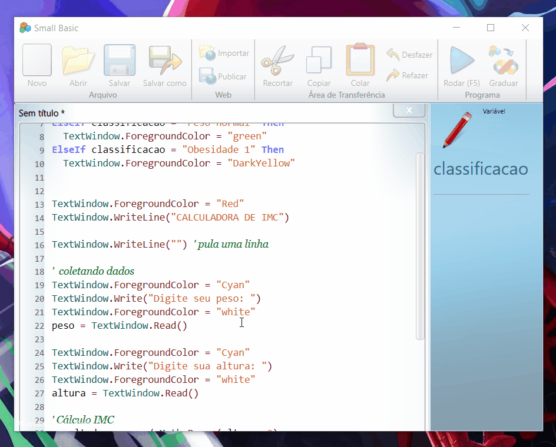

# Lógica de Programação 🤓📚

## Sobre mim (⌐■_■)✌

~~~javascript
usuario = Eder-Lucas
age = 17
living = Brasil-Pernambuco

valores = liberdade + respeito
cienciaDaComputacao = dedicacao + estudos

if usuario = dedicado and estudioso then
   ciencidaDaComputacao = true
endIf

sub objetivo
    TextWindow.writeLine("tornar a vida mais prática")
endSub

~~~
### Neste repositório contém:
 - _Meus projetos ⚙️🛠️_ 
 - _Exercícios 📚🧠_ 
 - _Anotações 📝✍️_ 

 

## Sobre o programa 🛠️💻

O SmallBasic é uma linguagem de programação simplificada criada pela Microsoft, com o objetivo de facilitar o aprendizado de programação para iniciantes.

~~~javascript
i = "NaoSeiTudo"
ThisProgram = "good"

while ThisProgram = "good" And i = "NaoSeiTudo"
   TextWindow.writeLine("Vou continuar estudando")
EndWhile
~~~

### Para executar os arquivos:

1. 💻 Faça o download do [SmallBasic](https://smallbasic-publicwebsite.azurewebsites.net/).
2. ⬇️ Abra o arquivo `.sb` no SmallBasic.
3. ⚙️ Execute o código!

> ⚠️ **Aviso:** O GitHub não permite o envio de arquivos `.exe`. Por isso, o executável **não está incluído** neste repositório.

 
