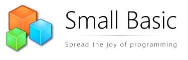

# Lógica de Programação 🤓📚

## Sobre mim (⌐■_■)✌

~~~javascript
usuario = Eder-Lucas
age = 17
living = Brasil-Pernambuco

valores = liberdade + respeito
cienciaDaComputacao = dedicacao + estudos

if usuario = dedicado and estudioso then
   ciencidaDaComputacao = true
endIf

sub objetivo
    textWindow.writeLine("tornar a vida mais prática")
endSub

~~~
### Neste repositório contém:
 - _Meus projetos ⚙️🛠️_ 
 - _Exercícios 📚🧠_ 
 - _Anotações 📝✍️_ 

 

## Sobre o programa 🛠️💻

O SmallBasic é uma linguagem de programação simplificada criada pela Microsoft, com o objetivo de facilitar o aprendizado de programação para iniciantes. Ela é projetada para ser intuitiva e acessível, permitindo que qualquer pessoa, mesmo sem experiência prévia em programação, possa começar a criar seus próprios programas rapidamente.

### Para executar os arquivos:

1. 💻 Faça o download do [SmallBasic](https://smallbasic-publicwebsite.azurewebsites.net/).
2. ⬇️ Abra o arquivo `.sb` no SmallBasic.
3. ⚙️ Execute o código!

 
